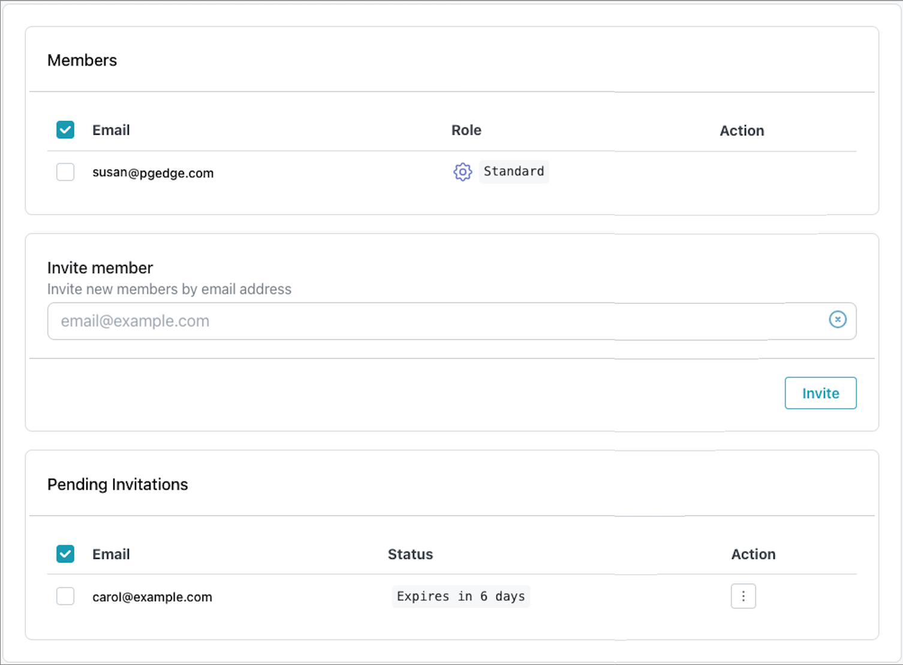
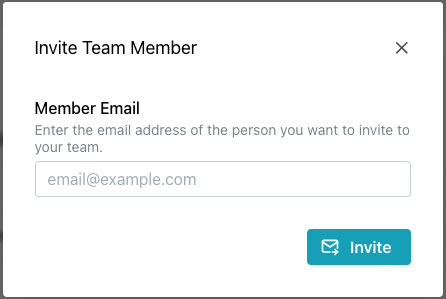

# Managing Team Resources

In the lower-left corner of the Cloud console is a link to the `Team Management` page; you can use the page to view a list of team members, invite members to your team, and manage pending or expired invitations.

* The `Members` table lists the current members of your team; use the context menu in the `Action` column to delete a member from the team.
* The `Pending Invitations` table lists invitations that have not been accepted.Unaccepted invitations expire in six days; select `Delete` from the context menu in the `Action` column to delete an invitation.

To invite a team member to join your team, select the `Add Team Member` icon in the upper-right corner of the `Team` dialog.

Enter an email address in the `Invite Team Member` field and select the `Invite` button to send an email to the address, inviting the recipient to join your team.

When you invite a user to join your team, they are taken to the pgEdge Welcome window where they are prompted to provide a password.  After providing a password, the new team member is taken to the main console page for your team, where all assets managed by the specified team are displayed. The `Pending Invitation` is removed, and the new member is listed in the `Members` table.