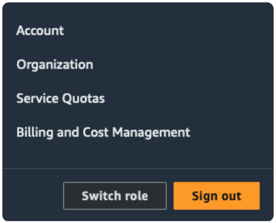

# Troubleshooting Cloud Issues

**Terraform apply failed: Error: creating EC2 VPC**

When spinning up a cluster, if you encounter an error with the text:

*terraform apply failed: Error: creating EC2 VPC: operation error EC2: CreateVpc, https response error StatusCode: 400, RequestID: fa9c832a-6789-47aa-a818-1cf272984fcc, api error VpcLimitExceeded: The maximum number of VPCs has been reached. Error: creating EC2 VPC: operation error EC2: CreateVpc, https response error StatusCode: 400, RequestID: 075bf34e-e7bc-4780-9854-2b9615d6a85b, api error VpcLimitExceeded: The maximum number of VPCs has been reached.*

This error occurs when you have reached the maximum number of VPCs allocated for your region; by default, 5 VPCs are allocated. To increase the number of allocated VPCs for your account, log in to the AWS management console, and submit an increase request by selecting `Service Quotas` from the drop-down menu in the upper-right corner:

For more information about viewing and managing service quotas on AWS, please see the [AWS documentation](https://aws.amazon.com/getting-started/hands-on/request-service-quota-increase/).