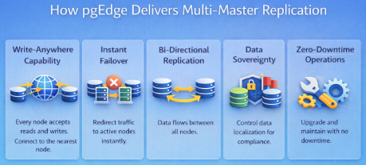

---
hide:
  - toc
  - navigation
---

<!-- Hero Section -->

  <h1>Welcome to pgEdge Documentation</h1>
  

    <strong>Enterprise-ready PostgreSQL that scales with your needs—from a single database to globally distributed multi-master deployments.</strong>
  

  

    pgEdge delivers hardened, production-grade PostgreSQL with a seamless path from day one through global scale. Whether you're running a single database, deploying primary-replica configurations, or orchestrating active-active multi-master clusters across continents, pgEdge provides a unified platform built on 100% standard, open source PostgreSQL.
  

<!-- Getting Started - Choose your Deployment -->

  <h2>Getting Started - Choose your Deployment</h2>
  
Your deployment method determines how you install, configure, and manage pgEdge Enterprise Postgres. Each method provides access to the same powerful capabilities.

  

    

      <h3>pgEdge Cloud</h3>
    

    

      Fully managed PostgreSQL service. Provision single-node or fully-distributed clusters in 90 seconds across AWS, Azure, or GCP. Zero infrastructure management.
    

    <a href="cloud/" class="card-link">View Documentation →</a>
  

  

    

      <h3>Kubernetes</h3>
    

    

      Cloud-native deployments with Helm charts and CloudNativePG integration. Single-command installation with declarative configuration for production clusters.
    

    <a href="pgedge-containers/" class="card-link">View Documentation →</a>
  

  

    

      <h3>VMs & Bare Metal</h3>
    

    

      Direct installations on virtual machines or physical servers. Enterprise packages, CLI orchestration, Control Plane API, or Ansible automation for maximum control.
    

    

      <a href="enterprise/" class="card-link">Installation →</a>
      <a href="control-plane/" class="card-link">Orchestration →</a>
    

  

<!-- Key Components -->

  <h2>Key Components</h2>
  
Powerful components that work together to deliver enterprise PostgreSQL capabilities.

  

    

      <h3>Control Plane</h3>
    

    

      Declarative API for database lifecycle management. Deploy, configure, and manage PostgreSQL clusters programmatically with Kubernetes-style orchestration.
    

    <a href="control-plane/" class="card-link">View Documentation →</a>
  

  

    

      <h3>Enterprise Repository</h3>
    

    

      Hardened PostgreSQL packages (RPM/APT) with curated extensions, performance tuning, and security updates. Battle-tested for production workloads on RHEL, Debian, and Ubuntu.
    

    <a href="enterprise/" class="card-link">View Documentation →</a>
  

  

    

      <h3>AI Toolkit</h3>
    

    

      Production-ready AI infrastructure for PostgreSQL. MCP Server for AI agents, RAG pipeline with hybrid search, automatic vectorization, and document loading—all PostgreSQL-native.
    

    <a href="pgedge-postgres-mcp-server/" class="card-link">View Documentation →</a>
  

<!-- Extensions & Components -->

  <h2>Extensions & Components</h2>
  
Purpose-built extensions that enable pgEdge's advanced capabilities.

  

    <h3>Replication & Distribution</h3>
    <ul class="extension-list">
      <li>
        <a href="spock-v5/"><strong>Spock v5</strong></a>
        Logical multi-master replication with bi-directional data flow and conflict resolution
      </li>
      <li>
        <a href="lolor/"><strong>LOLOR</strong></a>
        Large object replication for handling BLOBs in distributed environments
      </li>
      <li>
        <a href="snowflake/"><strong>Snowflake</strong></a>
        Distributed sequence generation for cluster-wide unique IDs
      </li>
    </ul>
  

  

    <h3>AI & Agentic Capabilities</h3>
    <ul class="extension-list">
      <li>
        <a href="pgedge-postgres-mcp-server/"><strong>MCP Server</strong></a>
        Model Context Protocol server for LLM and AI agent access to PostgreSQL
      </li>
      <li>
        <a href="pgedge-vectorizer/"><strong>Vectorizer</strong></a>
        Automatic document chunking and vector embedding generation
      </li>
      <li>
        <a href="pgedge-rag-server/"><strong>RAG Server</strong></a>
        High-performance Retrieval-Augmented Generation API with hybrid search
      </li>
      <li>
        <a href="pgedge-docloader/"><strong>DocLoader</strong></a>
        Command-line utility for loading documents into PostgreSQL for AI applications
      </li>
    </ul>
  

  

    <h3>Operations & Utilities</h3>
    <ul class="extension-list">
      <li>
        <a href="ace/"><strong>ACE (Active Consistency Engine)</strong></a>
        Automated data integrity verification and repair across replicated clusters
      </li>
      <li>
        <a href="control-plane/"><strong>Control Plane</strong></a>
        Declarative API for database lifecycle management and orchestration
      </li>
      <li>
        <a href="radar/"><strong>Radar</strong></a>
        Agentless diagnostic data collection for PostgreSQL and system metrics
      </li>
      <li>
        <a href="pgedge-anonymizer/"><strong>Anonymizer</strong></a>
        PII replacement for safe dev/test database copies
      </li>
      <li>
        <a href="pgedge-loadgen/"><strong>Loadgen</strong></a>
        Realistic workload generation and performance testing
      </li>
    </ul>
  

<!-- How Multi-Master Works -->

  <h3>How pgEdge Delivers Multi-Master Replication</h3>
  
Traditional PostgreSQL uses a primary-standby model where only one node accepts writes. pgEdge's multi-master (active-active) approach changes this paradigm:

  

    

    

      <a href="https://www.pgedge.com/solutions/benefit/multi-master">Learn more about multi-master architectures →</a>
    

  

<!-- Footer -->

  

    <strong>Resources:</strong>
    <a href="https://github.com/pgEdge" style="margin: 0 0.75rem;">GitHub</a> •
    <a href="https://www.pgedge.com" style="margin: 0 0.75rem;">Website</a> •
    <a href="https://www.pgedge.com/support" style="margin: 0 0.75rem;">Support</a> •
    <a href="https://discord.com/invite/pgedge" style="margin: 0 0.75rem;">Discord</a>
  

  

    pgEdge is built by industry veterans with decades of PostgreSQL expertise. Founded in 2022 and headquartered in Northern Virginia, pgEdge serves prominent enterprises including Bertelsmann, Qube RT, European Parliament, and multiple U.S. government agencies.
  

