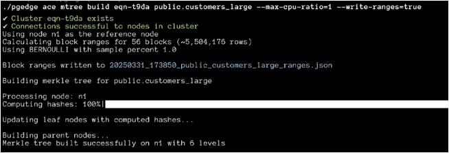
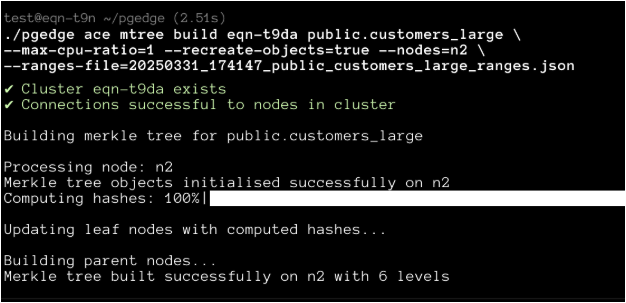

# Enhancing ACE Performance with Merkle Trees

!!! info

    ACE Merkle trees are added as an experimental optimisation with release of the pgEdge Distributed Postgres (CLI 25.2); we encourage caution before using this feature in a production environment.

ACE adds functionality that uses [Merkle trees](https://en.wikipedia.org/wiki/Merkle_tree) to make table comparisons significantly faster. In most cases, performing a normal mode table-diff, when run with tuned parameters, can produce diff reports in anywhere from a few seconds to a few minutes depending on the size of the table, network latency, disc I/O latency, and similar factors. The Merkle tree feature in ACE is intended for tables where performing a diff without a Merkle tree might take hours to complete.

## Initialising the Merkle Tree Objects for a Table

You must perform two initialisation steps before using Merkle trees:

* Create the Merkle tree functions and operators at the database level.
* Create a Merkle tree metadata table for the candidate table.

The following command initialises functions and operators at the database level:

`./pgedge ace mtree init cluster_name`

The second command creates pre-computed hash objects and triggers on the candidate table. If you pass `--recreate-objects=true` during the build phase, the previous step is not necessary. Use the following command to build a pre-computed hash table:

`./pgedge ace mtree build cluster_name schema_name.table_name --max-cpu-ratio=1 --recreate-objects=true`

This command creates a table in which to store the Merkle tree of the candidate table, and adds triggers to track modifications to it.

!!! info

    Building the pre-computed hash table (the Merkle tree table) is a one-time operation. Once built, ACE tracks changes on the table and automatically updates the tree when you perform a table-diff.

It is also worth noting here that because the Merkle tree feature in ACE is built to handle very large tables, it uses probabilistic sampling and estimates to compute things such as the number of rows, primary key ranges, etc.  For these estimates to work correctly, the table should be `ANALYZED` beforehand. You can pass in `--analyse=true` during the Merkle tree build to let ACE analyse the table, but we recommend that an `ANALYZE table` is performed manually on the table before invoking `mtree build` with ACE simply because it might take a while for the analysis to complete. However, if you are not actively using the table, then `ANALYZE` may not be necessary.

### Building Merkle Trees in Parallel

If your table is extremely large (say, close to a billion rows, or ~1 TB in size), then building the tree even on a single node might take a non-trivial amount of time. The good news is that the build operation needs to happen just once per table per cluster. If the ACE (management) node is used to remotely build the trees on each node, there is additional latency because of the network distance between the ACE host and the database instances.

For example, if you are using the `n1` node as the ACE management node of a three-node pgEdge cluster (with `n1`, `n2`, and `n3`), building the tree on `n1` may be comparatively faster (because of network latency) than when ACE on `n1` tries to build the same tree on `n2` or `n3`. 

As a workaround, you can build the Merkle trees in parallel; when you invoke the `mtree build` command, include the `--write-ranges=true` clause as shown below:

`./pgedge ace mtree build cluster_name schema_name.table_name --max-cpu-ration=1 --write-ranges=true`

This command outputs the computed ranges to a file, and then begins the hash computations.  While that command is running, you can `scp` the `ranges` file to the remaining nodes.  Then, on the other nodes, use the same `mtree build` command, but this time, specify the file name with the `--ranges-file=/path/to/ranges-file.txt` option as shown below:

`./pgedge ace mtree build cluster_name schema_name.table_name --max-cpu-ration=1 --recreate-objects=true --nodes=node_name --ranges-file=/path/to/ranges-file.txt`

While running the build on each node using the `--ranges-file` option, make sure to specify only one specific node in the `--nodes` option.  For example, when building a tree on `n1`, include `--nodes=n1`, or when building a tree on `n2`, include `--nodes=n2`, or ACE will attempt to remotely create the Merkle tree tables on other nodes in the cluster - the very thing you want to avoid for large tables.

## Using ACE Functions with Merkle Trees

The following ACE commands use and manage Merkle tree functionality.

### mtree table-diff

To perform a table-diff using a Merkle tree, use the command:

`./pgedge ace mtree table-diff cluster_name schema_name.table_name`

### mtree update

Performing an mtree table-diff automatically updates the Merkle tree before performing the diff. You can also perform a Merkle tree update with the command:

`./pgedge ace mtree update cluster_name schema_name.table_name`

Passing in `--rebalance=true` with either a diff or update command will perform splits and merges of blocks based on changes in the underlying keyspace; you don't need to perform a  rebalancing unless it's essential. The default update operation in `mtree table-diff` takes care of block splits and updates but defers merges. This is to preserve parent-child relationships and avoid costly recursions due to merged blocks.

### mtree teardown

You can remove table-specific triggers and objects with the following command:

`./pgedge ace mtree teardown cluster_name schema_name.table_name`

To remove cluster-level objects (custom operators, generic functions, etc.) use the following command:

`./pgedge ace mtree teardown cluster_name`

## Performance Considerations

Since the Merkle tree initialisation process adds triggers to the candidate table, you may encounter a performance impact on normal user queries to the table. This impact is application dependent and needs to be measured and deemed acceptable before using this feature.
