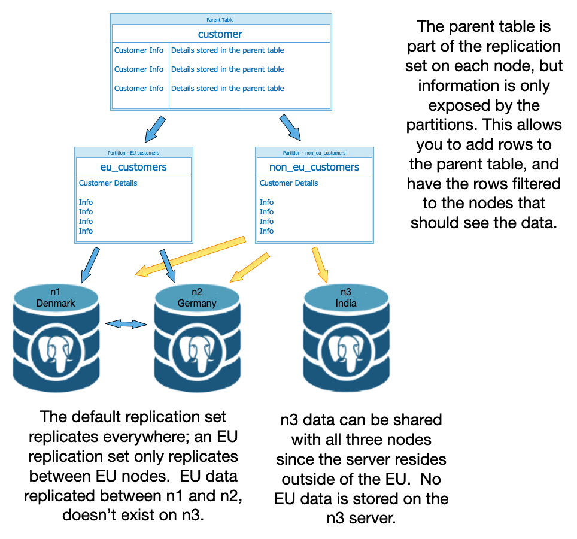

# Using Replication Sets to Filter Data

When you create a replication cluster, you identify one or more publisher and subscriber nodes; in a multi-master distributed replication cluster, each node can be a publisher, a subscriber, or both. Each publisher node maintains a list of the tables that are replicated to each subscriber node. That information is stored in the *replication set*.

A replication set organizes the rules about how content is replicated. Those rules are applied to both tables and subscriber nodes:

* A table can be included in multiple replication sets, but if a table is not included in at least one replication set that is associated with a subscriber, changes to that table will not be replicated. 

* Similarly, a subscriber may subscribe to multiple replication sets, but if it does not subscribe to any replication sets, changes will not be replicated to that subscriber node.

By controlling the content of a table or tables, the replication set to which a table belongs, and the nodes that subscribe to that replication set, you can create filters, essentially separating your data into sets (or subsets) that are then distributed to the appropriate subscriber nodes in your cluster. The information that is earmarked to be replicated will be replicated only to those subscribers that subscribe to the specified set. 

**Note:** If you are filtering content to some nodes but not others, automatic DDL replication must be disabled. Automatic DDL replication will replicate all DDL statements, and add all tables to the `default` replication set, essentially undoing filtering.

This flexibility allows a multi-master replication cluster to better meet the needs of administrators that are required to:

* Conform to PII rules that keep personal data within borders.
* Improve performance by moving data closer to the user that consumes it most often.
* Provide fine-grained access control for sensitive data.
* Store lesser-used information on a less expensive host.

When you create a replication cluster with pgEdge Distributed Postgres, the installer creates three replication sets:

**`default`** - The `default` replication set replicates all changes to the tables that are members.
**`default_insert_only`** - The `default_insert_only` replication set replicates `INSERT` statements from tables with or without a primary key. If your table does not have a primary key, add it to the `default_insert_only` replication set  to replicate the rows added to it with an `INSERT` statement. 
**`ddl_sql`** - The `ddl_sql` replication set replicates schema changes specified by `spock.replicate_ddl`.

You can find information about the existing replication sets by connecting to your cluster with PSQL, and invoking the following query:

```
my_db=# SELECT * FROM spock.replication_set;
   set_id   | set_nodeid |      set_name       | replicate_insert | replicate_update | replicate_delete | replicate_truncate 
------------+------------+---------------------+------------------+------------------+------------------+--------------------
  705578428 |  673694252 | default             | t                | t                | t                | t
 4055409865 |  673694252 | default_insert_only | t                | f                | f                | t
  833063447 |  673694252 | ddl_sql             | t                | f                | f                | f
(3 rows)
```

When you create a replication set, you can include Spock options to identify the type of data that is replicated from tables in that repset; include one or more the following flags after a call to [`pgedge spock repset-create`](../pgedge_commands/doc/spock-repset-create.md) to replicate the following statement types:

| Option | Filter Description |
|----------|------------------------|
| `--replicate_insert` | Replicate `INSERT` statements on tables that are members of the replication set. |
| `--replicate_update` | Replicate `UPDATE` statements on tables that are members of the replication set. |
| `--replicate_delete` | Replicate `DELETE` statements on tables that are members of the replication set. |
| `-- replicate_truncate` | Replicate `TRUNCATE` statements on tables that are members of the replication set. | 

By default (if you do not include any of the options), all transaction types are replicated.

Along with the Spock extension, you can use SQL commands, CLI commands, and even your custom application to filter data into specific tables for selective replication. After isolating content in the correct tables or partitions, use Spock commands to manage the replication sets and subscriptions. By organizing the creation, addition, distribution, and removal of data, you can create an organic, distributed data environment:



The diagram above shows how you can use replication membership to filter entries to specific nodes.

| Node | Subscription | Replication Set Membership |
|------|----------|------------------------|
| n1, Denmark | sub_n1n3 | Default |          
| n1, Denmark | sub_n1n2 | Default and EU Members |          
| n2, Germany | sub_n2n3 | Default |          
| n2, Germany | sub_n2n1 | Default and EU Members |
| n3, India   | sub_n3n1 | Default |          
| n3, India   | sub_n3n2 | Default |          


## Managing Partitions, Replication Sets, and Subscriptions

Real life can present partitioning/filtering scenarios that become quite complex quickly. Spock provides commands that help streamline the process of adding and removing partitions from replication sets, and replication sets from subscriptions. The following commands are some of the most-frequently when employing this technique for filtering data:

* To add a parent table and the table's partitions to a replication set, use the [spock repset-add-table](../pgedge_commands/doc/spock-repset-add-table.md) command. 

* Then to remove selective content from each replication set, use the [spock repset-remove-partition](../pgedge_commands/doc/spock-repset-remove-partition.md) command.  As you remove each partition, the CLI responds:

* If you add more partitions to the table, use the [spock repset-add-partition](../pgedge_commands/doc/spock-repset-add-partition.md) command to add them to your replicated table.

* To subscribe to a replication set, use the [spock sub-add-repset](../pgedge_commands/doc/spock-sub-add-repset.md) command on the subscribing node.

* To unsubscribe from a replication set, use the [spock sub-remove-repset](../pgedge_commands/doc/spock-sub-remove-repset.md) command on the node that you are unsubscribing.


### Using a Partitioned Table to Filter Replicated Content

By breaking a table into multiple smaller tables (*partitions*), you can control the node or nodes that the data is accessible from by adding selective partitions to a replication set that is shared with a specific subscriber. In the example that follows, we'll use [partitioning functionality](https://www.postgresql.org/docs/16/ddl-partitioning.html) to break a table into LIST partitions.  Postgres supports the following partition types:

* range partition (the value of a key column identifies the content of each table)
* list partition (key values determine the content of each table)
* hash partition (a hash value determines which table that content is stored in)

After creating the partition tables, our example uses Spock functions to manage the distribution of data to different nodes:

* Use [spock repset-add-table](../pgedge_commands/doc/spock-repset-add-table.md) on all of the nodes in your cluster to add the parent and partition tables to the replication set.
* Use [spock repset-remove-partition](../pgedge_commands/doc/spock-repset-remove-partition.md) on the appropriate nodes to remove the partitions you want to filter from exposure on that node.
* Use [spock repset-add-partition](../pgedge_commands/doc/spock-repset-add-partition.md) on all of the nodes in your cluster to update the partitions when adding a new partition.

In the example that follows, we'll create a partitioned table, and add and remove access to selected nodes in the cluster.  To use the commands in the example, you'll first need to install and configure a replication cluster on your system.

After installing the CLI:

* Use the [CREATE TABLE](https://www.postgresql.org/docs/16/sql-createtable.html) statement to create the parent table; content added to the parent table will be filtered automatically to the table's partitions. 
* Create partitions that break the parent table into partitions based on content and your business needs. You may want to remove a portion of your data from a region or server based on transaction location, transaction date, or another business-relevant requirement. Postgres documentation provides detailed information about [partitioning and sub-partitioning](https://www.postgresql.org/docs/16/ddl-partitioning.html).

* Add a small set of data to the table.
* Use Spock commands to add and remove tables from your replication set as appropriate:

  * Use [repset-add-table](../pgedge_commands/doc/spock-repset-add-table.md) on each node to add the parent table and all of the existing partitions to your replication set.
  * Use [repset-remove-partition](../pgedge_commands/doc/spock-repset-remove-partition.md) on selective nodes to remove partitions that would expose data that shouldn't be available to those node users.
  * Use [repset-add-partition](../pgedge_commands/doc/spock-repset-add-partition.md) to update the replication set when you add new partitions to the replication set. 

**Example: Filtering Content by Replication Set**

In our example, we're going to create a table that contains customer information for a distributed company.  The table contains information that will be shared selectively; information will be restricted to the EU region for those nodes that are EU members, and all other regions for non-EU residents. 

*Note:* Our example assumes you do not have automatic DDL replication enabled. The initial DDL setup steps in this example must be performed on each node of the cluster.

After [installing Postgres and creating a basic cluster](../installing_pgedge/manual.md), move into the installation directory, source your environment variables, and connect to the database with PSQL:

```sql
$ source cluster/demo/n1/pgedge/pg16/pg16.env

$ psql --port 6432 -d my_db

psql (16.3)
Type "help" for help.
```

For our example, are going to create a table named `customer` to store customer information:

```sql
CREATE TABLE public.customer (
    cust_id integer,
    cust_name varchar(40),
    cust_contact varchar(40),
    cust_address varchar(60),
    city varchar(15),
    country_code char(2),
    sales_contact smallint,
    sales_date_added date) PARTITION BY LIST (country_code);
```

Then, we use the [ALTER TABLE](https://www.postgresql.org/docs/16/sql-altertable.html) command to add a key to our table:

`ALTER TABLE public.customer ADD CONSTRAINT primary_constraint PRIMARY KEY (cust_id, country_code);`

Then, we'll create `LIST` partitions on each node that separate the data into replication sets; EU members will be in one partition (`eu_members`) and all other customers will be in the default partition (`non_eu_members`):

```sql
CREATE TABLE eu_members PARTITION OF public.customer FOR VALUES IN ('BE', 'BG', 'CZ', 'DK', 'DE', 'EE', 'IE', 'EL', 'ES', 'FR', 'HR', 'IT', 'CY', 'LV', 'LT', 'LU', 'HU', 'MT', 'NL', 'AT', 'PL', 'PT', 'RO', 'SI', 'SK', 'FI', 'SE');

CREATE TABLE non_eu_members PARTITION OF public.customer DEFAULT;
```

The following statements add some sample data:

```sql
INSERT INTO public.customer VALUES ('1001', 'Acme Widgets', 'A. Anderson', '100 Andergar Place', 'Asheville', 'US', 10, '2023-01-01');
INSERT INTO public.customer VALUES ('1002', 'Big Tech, LLC', 'B. Brandt', '202 Blackburn Drive', 'Birmingham', 'UK', 20, '2023-01-02');
INSERT INTO public.customer VALUES ('1003', 'CHO Enterprises', 'C. Cleaves', '3003 Carter Circus', 'Kent', 'UK', 80, '2022-02-12');
INSERT INTO public.customer VALUES ('1004', 'Daily Charters', 'D. Drysdale', '18300 Dogwood Street', 'Dublin', 'IE', 40, '2023-11-21');
INSERT INTO public.customer VALUES ('1005', 'Eagle Tiles', 'E. Easten', '10890 Elm Avenue', 'Essen', 'DE', 10, '2023-04-21');
INSERT INTO public.customer VALUES ('1006', 'Fairfood Farms', 'F. Foster', '10770 Figeroa Street', 'Frankfurt', 'DE', 80, '2023-05-31');
INSERT INTO public.customer VALUES ('1007', 'Galaxy Powertools', 'G. Grafton', '190 General Way', 'Greeley', 'US', 30, '2024-01-14');
INSERT INTO public.customer VALUES ('1008', 'Hall International', 'H. Harper', '3100 Howard Run', 'Hamburg', 'DE', 40, '2024-02-11');
INSERT INTO public.customer VALUES ('1009', 'Introspective Tech', 'I. Indrees', '1900 Industy Way', 'Itiki', 'IN', 10, '2023-09-07');
INSERT INTO public.customer VALUES ('1010', 'JJ Hydraulics', 'J. Jackson', '10980 Johnson Blvd', 'Jacksonville', 'US', 90, '2023-08-12');
INSERT INTO public.customer VALUES ('1011', 'Kadmi Industries', 'K. Kendricks', '9778 King Blvd', 'Kortrijk', 'BE', 30, '2022-11-15');
INSERT INTO public.customer VALUES ('1012', 'Lumin Electronics', 'L. Langton', '340 Lauderbach St', 'Leuven', 'BE', 50, '2023-10-16');
INSERT INTO public.customer VALUES ('1013', 'Multi-tech Parts', 'M. Maccay', '998 Main Street', 'Mumbai', 'IN', 70, '2024-03-28');
INSERT INTO public.customer VALUES ('1014', 'National Distribution LLC', 'N. Newton', '210 North Run Blvd', 'Nima', 'IN', 20, '2024-04-09');
INSERT INTO public.customer VALUES ('1015', 'Odyssey Telecomm', 'O. Oppenheimer', '1050 Overland Way', 'Odessa', 'LU', 30, '2023-07-01');
INSERT INTO public.customer VALUES ('1016', 'Power Systems', 'P. Price', '1899 Pearl Place', 'Penryn', 'SI', 40, '2023-01-18');
INSERT INTO public.customer VALUES ('1017', 'Quotient Tech', 'Q. Quentin', '11 Queen Anne Way', 'Qorqut', 'HR', 10, '2024-01-19');
INSERT INTO public.customer VALUES ('1018', 'Raja Wellness', 'R. Randall', '19880 Rose Street', 'Rotterdam', 'NL', 20, '2023-06-05');
INSERT INTO public.customer VALUES ('1019', 'Solar Systems, LLC', 'S. Strange', '2889 South 73rd', 'Stockholm', 'SW', 60, '2023-07-01');
INSERT INTO public.customer VALUES ('1020', 'Tangent Plane', 'T. Trenton', '9897 Thorne Road', 'Lake Tahoe', 'US', 70, '2022-11-01');
INSERT INTO public.customer VALUES ('1021', 'Universal Semiconductor', 'U. Ulls', '1886 Unified Parkway', 'Untertal', 'DE', 90, '2022-10-15');
INSERT INTO public.customer VALUES ('1022', 'Value Added Tooling', 'V. Vinton', '1299 Vista Valley Way', 'Vienna', 'AU', 20, '2023-06-15');
INSERT INTO public.customer VALUES ('1023', 'WebStar Consulting', 'W. Woodward', '200 Waterfront Drive', 'Warsaw', 'PL', 40, '2024-05-07');
INSERT INTO public.customer VALUES ('1024', 'XL Technology', 'X. Xavier', '120 North King Street', 'Washington', 'US', 40, '2024-03-09');
INSERT INTO public.customer VALUES ('1025', 'Young Consulting, LLC', 'Y. Young', '800 Yew Street', 'York', 'UK', 70, '2023-03-15');
INSERT INTO public.customer VALUES ('1026', 'Zen International', 'Z. Ziffle', '1998 Zenith Way', 'Zagreb', 'CR', 20, '2023-02-26');
```

You can use the `\d` PSQL meta-command to see our tables:

```sql
my_db=# \d
                  List of relations
 Schema |      Name      |       Type        | Owner 
--------+----------------+-------------------+-------
 public | customer       | partitioned table | susan
 public | eu_members     | table             | susan
 public | non_eu_members | table             | susan
(3 rows)
```

Then, exit PSQL:

`\q`

Navigate into each node directory and add the parent of the partitioned tables to the `default` replication set; this automatically adds the partition tables as well:

`./pgedge spock repset-add-table default customer my_db`

Then, apply partition filtering to limit access to the EU data to only those nodes that reside inside of the EU. On nodes that reside outside of the EU, invoke the command:

`./pgedge spock repset-remove-partition customer my_db --partition=eu_members`

To test the replication, connect with PSQL and add a new record to the parent table (`public.customer`):

```sql
INSERT INTO public.customer VALUES ('1027', 'Astro Adventures', 'A. Azimuth', '7667 Ace Avenue', 'Aarhus', 'DK', 20, '2024-03-26');
```

This row will be added to parent table (`public.customer`) and the `eu_members` partition, and replicated to all nodes within the cluster that subscribe to the `eu_members` replication set; you can verify it on each node of the cluster with the commands:

```sql
SELECT * FROM public.customer WHERE cust_id=1027;
SELECT * FROM public.eu_members WHERE cust_id=1027;
SELECT * FROM public.non_eu_members WHERE cust_id=1027;
```
On nodes subscribing to the `eu_members` replication set:

```sql
my_db=# SELECT * FROM public.customer WHERE cust_id=1027;
 cust_id |    cust_name     | cust_contact |  cust_address   |  city  | country_code | sales_contact | sales_date_added 
---------+------------------+--------------+-----------------+--------+--------------+---------------+------------------
    1027 | Astro Adventures | A. Azimuth   | 7667 Ace Avenue | Aarhus | DK           |            20 | 2024-03-26
(1 row)

my_db=# SELECT * FROM public.eu_members WHERE cust_id=1027;
 cust_id |    cust_name     | cust_contact |  cust_address   |  city  | country_code | sales_contact | sales_date_added 
---------+------------------+--------------+-----------------+--------+--------------+---------------+------------------
    1027 | Astro Adventures | A. Azimuth   | 7667 Ace Avenue | Aarhus | DK           |            20 | 2024-03-26
(1 row)

my_db=# SELECT * FROM public.non_eu_members WHERE cust_id=1027;
 cust_id | cust_name | cust_contact | cust_address | city | country_code | sales_contact | sales_date_added 
---------+-----------+--------------+--------------+------+--------------+---------------+------------------
(0 rows)
```

Nodes that don't subscribe to the `eu_members` replication set see:

```sql
my_db=# SELECT * FROM public.customer WHERE cust_id=1027;
 cust_id |    cust_name     | cust_contact |  cust_address   |  city  | country_code | sales_contact | sales_date_added 
---------+------------------+--------------+-----------------+--------+--------------+---------------+------------------
(0 rows)

my_db=# SELECT * FROM public.eu_members WHERE cust_id=1027;
 cust_id |    cust_name     | cust_contact |  cust_address   |  city  | country_code | sales_contact | sales_date_added 
---------+------------------+--------------+-----------------+--------+--------------+---------------+------------------
(0 rows)

my_db=# SELECT * FROM public.non_eu_members WHERE cust_id=1027;
 cust_id | cust_name | cust_contact | cust_address | city | country_code | sales_contact | sales_date_added 
---------+-----------+--------------+--------------+------+--------------+---------------+------------------
(0 rows)
```

Now lets add a row that will be part of the `non_eu_members` replication set. Use the command: 

```sql
INSERT INTO public.customer VALUES ('1028', 'Bharat Solutions', 'B. Bharati', '7667 Bajaj', 'Bangalore', 'IN', 30, '2024-04-21');
```

The row will be added to the parent table, the `non_eu_member` partition table, and the `non_eu_member` replication set; you can verify it on each node of the cluster with the commands:

```sql
SELECT * FROM public.customer WHERE cust_id=1028;
SELECT * FROM public.eu_members WHERE cust_id=1028;
SELECT * FROM public.non_eu_members WHERE cust_id=1028;
```

The row is visible to all nodes in the cluster.


### Filtering Sensitive Data by Column or Row

When you add a table to a replication set, you can use Spock options to instruct that replication set which information is replicated by the replication set.  You can selectively omit content from replication with the following `spock repset-add-table` options:

* The `-r` or `--row_filter` option to specify a row/value pair that will be determine which data is replicated.  If this flag is omitted, all rows will be replicated.
* The `-c` or `--columns` option to specify a list of columns that will be replicated.  If this flag is omitted, all columns will be replicated.

To add a column filter, use the command form:

`pgedge spock repset-add-table repset_name table_name db_name --columns 'column_one,column_two,column_three'`

The list of columns specifies the columns you would like the node on which the replication set is created will replicate to the nodes that subscribe to the replication set. The columns should be provided in a comma-delimited list without spaces, (or you can enclose the list of columns in single-quotes).

To add a row filter, use the command form:

`pgedge spock repset-add-table repset_name table_name db_name --row_filter "row = value"`

Enclose the conditions of the `--row_filter` clause in double-quotes. If value is not an integer, enclose the condition clause in double-quotes and value in two pair of single-quotes (`"row = ''value''`). You can use Postgres operators in place of the = sign above to specify the condition that filters the data (i.e. `'row > 5000'`).  

*Note:*  When using replication sets to filter sensitive data, you must disable automatic replication of DDL.  If you do not disable automatic DDL replication, auto DDL will create each table/replication set on each node without the filters.  Then, if you modify the table, it will add it back to the default replication set, undoing your filters.

#### Example: Applying a Column Filter 

When you add a table to a replication set, you can specify the columns that you wish to include in the replicated data.  For example, in an `employee` table you have information that is needed by HR (like a social security number or birthday), but that shouldn't be available to all employees.  

We're going to use a two-node cluster for our example; on the cluster, we're going to create a table (`public.employee`) that holds employee information.  All of the information is available to all employees *except* the `emp_govt_id` data and the `emp_birth_date` data which we'll restrict to distribution on node `n1`.  Employees viewing the information from node n2 will not see a value in those fields, but all other fields will be visible.

To perform the steps in our example, [create a two-node cluster](../installing_pgedge/manual.md) with automatic DDL updates disabled.  First, connect to the database on node `n1` with psql and create a table with the following command:

```sql
CREATE TABLE public.employee (
    emp_id smallint Primary Key,
    emp_govt_id varchar(15),
    emp_first_name varchar(40),
    emp_last_name varchar(40),
    emp_address varchar(60),
    emp_city_state varchar(15),
    emp_country varchar(2),
    emp_birth_date date,
    emp_division varchar(7),
    emp_date_added date);
```

Then, exit psql (`\q`) and modify the `default` replication set on `n1` so it replicates every column to `n2` except for `emp_govt_id` and `emp_birth_date`:

`./pgedge spock repset-add-table default employee my_db --columns emp_id,emp_first_name,emp_last_name,emp_address,emp_city_state,emp_country,emp_division,emp_date_added`

Then, connect to `n2` with psql and create the table:

```sql
CREATE TABLE public.employee (
    emp_id smallint Primary Key,
    emp_govt_id varchar(15),
    emp_first_name varchar(40),
    emp_last_name varchar(40),
    emp_address varchar(60),
    emp_city_state varchar(15),
    emp_country varchar(2),
    emp_birth_date date,
    emp_division varchar(7),
    emp_date_added date);
```

Then, we'll exit psql (`\q`) and modify the `default` replication set to replicate changes to the table made on `n2` to `n1`: 

`./pgedge spock repset-add-table default employee my_db`

On `n1`, the `default` replication set has column filters.  Since `sub_n2n1` is subscribed to that replication set, `n2` receives the filtered data. `sub_n1n2` is subscribed to include the `default` replication set defined on `n2`, where data is replicated to `n1` without a filter.

Connect to `n1` with psql, and load the following data:

```sql
INSERT INTO public.employee VALUES ('10', '738963773', 'Alice', 'Adams', '110 Austin Blvd', 'Austin, TX', 'US', '1983-01-06', 'mgmt', '2021-04-15');
INSERT INTO public.employee VALUES ('20', '08031375B89', 'Benson', 'Brown', 'Rosensweig 510', 'Berlin', 'DE', '1975-03-13', 'sales', '2023-02-18');
INSERT INTO public.employee VALUES ('30', '839467228377', 'Charles', 'Clark', '4, Amrita Rd', 'Delhi', 'IN', '1963-07-18', 'sales', '2022-05-22');
INSERT INTO public.employee VALUES ('40', '560389338', 'Douglas', 'Davis', '3758 Hampton Street', 'Seattle, WA', 'US', '1973-08-09', 'sales', '2020-08-12');
INSERT INTO public.employee VALUES ('50', '0809246719', 'Elaine', 'Evans', 'Hauptstrasse 9375', 'Frankfurt', 'DE', '1967-09-24', 'mgmt', '2021-09-13');
INSERT INTO public.employee VALUES ('60', '294667291937', 'Frederick', 'Ford', 'Flat 100, Triveni Apartments', 'Pune', 'IN', '1971-02-21', 'sales', '2021-03-11');
INSERT INTO public.employee VALUES ('70', '833029112', 'Geoffrey', 'Graham', '84667 Blake Blvd', 'New York, NY', 'US', '1982-01-14', 'mgmt', '2022-08-19');
INSERT INTO public.employee VALUES ('80', '06030764H21', 'Helen', 'Harris', 'Dresden 3-9883', 'Munich', 'DE', '1964-03-07', 'sales', '2022-12-12');
INSERT INTO public.employee VALUES ('90', '8874 7793 8299', 'Isaac', 'Ingram', '4758 Miller Lane', 'Wan Chai', 'HK', '1968-04-19', 'sales', '2020-06-01');
```
To check the results, log into each node with PSQL, and query the table - on `n1`:

```sql
my_db=# SELECT * FROM employee;
  emp_id |  emp_govt_id   | emp_first_name | emp_last_name |         emp_address          | emp_city_state | emp_country | emp_birth_date | emp_division | emp_date_added 
--------+----------------+----------------+---------------+------------------------------+----------------+-------------+----------------+--------------+----------------
     10 | 738963773      | Alice          | Adams         | 110 Austin Blvd              | Austin, TX     | US          | 1983-01-06     | mgmt         | 2021-04-15
     20 | 08031375B89    | Benson         | Brown         | Rosensweig 510               | Berlin         | DE          | 1975-03-13     | sales        | 2023-02-18
     30 | 839467228377   | Charles        | Clark         | 4, Amrita Rd                 | Delhi          | IN          | 1963-07-18     | sales        | 2022-05-22
     40 | 560389338      | Douglas        | Davis         | 3758 Hampton Street          | Seattle, WA    | US          | 1973-08-09     | sales        | 2020-08-12
     50 | 0809246719     | Elaine         | Evans         | Hauptstrasse 9375            | Frankfurt      | DE          | 1967-09-24     | mgmt         | 2021-09-13
     60 | 294667291937   | Frederick      | Ford          | Flat 100, Triveni Apartments | Pune           | IN          | 1971-02-21     | sales        | 2021-03-11
     70 | 833029112      | Geoffrey       | Graham        | 84667 Blake Blvd             | New York, NY   | US          | 1982-01-14     | mgmt         | 2022-08-19
     80 | 06030764H21    | Helen          | Harris        | Dresden 3-9883               | Munich         | DE          | 1964-03-07     | sales        | 2022-12-12
     90 | 8874 7793 8299 | Isaac          | Ingram        | 4758 Miller Lane             | Wan Chai       | HK          | 1968-04-19     | sales        | 2020-06-01
(9 rows)
```
On `n2`:

```sql
lcdb=# SELECT *  employee;
 emp_id | emp_govt_id | emp_first_name | emp_last_name |         emp_address          | emp_city_state | emp_country | emp_birth_date | emp_division | emp_date_added 
--------+-------------+----------------+---------------+------------------------------+----------------+-------------+----------------+--------------+----------------
     10 |             | Alice          | Adams         | 110 Austin Blvd              | Austin, TX     | US          |                | mgmt         | 2021-04-15
     20 |             | Benson         | Brown         | Rosensweig 510               | Berlin         | DE          |                | sales        | 2023-02-18
     30 |             | Charles        | Clark         | 4, Amrita Rd                 | Delhi          | IN          |                | sales        | 2022-05-22
     40 |             | Douglas        | Davis         | 3758 Hampton Street          | Seattle, WA    | US          |                | sales        | 2020-08-12
     50 |             | Elaine         | Evans         | Hauptstrasse 9375            | Frankfurt      | DE          |                | mgmt         | 2021-09-13
     60 |             | Frederick      | Ford          | Flat 100, Triveni Apartments | Pune           | IN          |                | sales        | 2021-03-11
     70 |             | Geoffrey       | Graham        | 84667 Blake Blvd             | New York, NY   | US          |                | mgmt         | 2022-08-19
     80 |             | Helen          | Harris        | Dresden 3-9883               | Munich         | DE          |                | sales        | 2022-12-12
     90 |             | Isaac          | Ingram        | 4758 Miller Lane             | Wan Chai       | HK          |                | sales        | 2020-06-01
(9 rows)

```

You can add additional rules on this table on `n2` to prevent a user from adding a `emp_govt_id` or `emp_birth_date` information, but the `--column` filter will only catch the data in replication from `n1`; information added to the database outside of replication will be visible to both nodes.  Essentially, in this scenario, all changes or additions to this table must be on `n1` to filter the information on `n2`.


#### Example: Applying Column and Row Filters

Similar to column filtering, row filtering allows you to prevent additions made on one node from being replicated to other nodes.  You can use row filtering to prevent the distribution of information to your cluster based on a `row=value` criteria.  For this example, we're going to use the same tables and data that we used in the columns example, but before replicating the data to n2, we'll add both the row and column filters; this prevents the replication of `emp_govt_id` and `emp_birth_date` data, as well as any rows where `emp_division` is not equal to `sales`.

First, connect to the database on node `n1` with psql and create a table with the following command:

```sql
CREATE TABLE public.employee (
    emp_id smallint Primary Key,
    emp_govt_id varchar(15),
    emp_first_name varchar(40),
    emp_last_name varchar(40),
    emp_address varchar(60),
    emp_city_state varchar(15),
    emp_country varchar(2),
    emp_birth_date date,
    emp_division varchar(7),
    emp_date_added date);
```

Then, exit psql (`\q`) and modify the `default` replication set on `n1` so it replicates every column to `n2` except for `emp_govt_id` and `emp_birth_date`.  We're also adding a `--row_filter` clause that keeps all of the `mgmt` rows on `n1` only; the `mgmt` data will not be included on `n2`:

`./pgedge spock repset-add-table default employee my_db --columns 'emp_id,emp_first_name,emp_last_name,emp_address,emp_city_state,emp_country,emp_division,emp_date_added' --row_filter="emp_division != ''mgmt''"`

Then, connect to `n2` with psql and create the table:

```sql
CREATE TABLE public.employee (
    emp_id smallint Primary Key,
    emp_govt_id varchar(15),
    emp_first_name varchar(40),
    emp_last_name varchar(40),
    emp_address varchar(60),
    emp_city_state varchar(15),
    emp_country varchar(2),
    emp_birth_date date,
    emp_division varchar(7),
    emp_date_added date);
```

Then, we'll exit psql (`\q`) and modify the `default` replication set to replicate changes to the table made on `n2` to `n1`: 

`./pgedge spock repset-add-table default employee my_db`

On `n1`, the `default` replication set has column filters.  Since `sub_n2n1` is subscribed to that replication set, `n2` receives the filtered data. `sub_n1n2` is subscribed to include the `default` replication set defined on `n2`, where data is replicated to `n1` without a filter.

Then, connect to `n1` with psql, and load the following data:

```sql
INSERT INTO public.employee VALUES ('10', '738963773', 'Alice', 'Adams', '110 Austin Blvd', 'Austin, TX', 'US', '1983-01-06', 'mgmt', '2021-04-15');
INSERT INTO public.employee VALUES ('20', '08031375B89', 'Benson', 'Brown', 'Rosensweig 510', 'Berlin', 'DE', '1975-03-13', 'sales', '2023-02-18');
INSERT INTO public.employee VALUES ('30', '839467228377', 'Charles', 'Clark', '4, Amrita Rd', 'Delhi', 'IN', '1963-07-18', 'sales', '2022-05-22');
INSERT INTO public.employee VALUES ('40', '560389338', 'Douglas', 'Davis', '3758 Hampton Street', 'Seattle, WA', 'US', '1973-08-09', 'sales', '2020-08-12');
INSERT INTO public.employee VALUES ('50', '0809246719', 'Elaine', 'Evans', 'Hauptstrasse 9375', 'Frankfurt', 'DE', '1967-09-24', 'mgmt', '2021-09-13');
INSERT INTO public.employee VALUES ('60', '294667291937', 'Frederick', 'Ford', 'Flat 100, Triveni Apartments', 'Pune', 'IN', '1971-02-21', 'sales', '2021-03-11');
INSERT INTO public.employee VALUES ('70', '833029112', 'Geoffrey', 'Graham', '84667 Blake Blvd', 'New York, NY', 'US', '1982-01-14', 'mgmt', '2022-08-19');
INSERT INTO public.employee VALUES ('80', '06030764H21', 'Helen', 'Harris', 'Dresden 3-9883', 'Munich', 'DE', '1964-03-07', 'sales', '2022-12-12');
INSERT INTO public.employee VALUES ('90', '8874 7793 8299', 'Isaac', 'Ingram', '4758 Miller Lane', 'Wan Chai', 'HK', '1968-04-19', 'sales', '2020-06-01');
```
To check the results, log into each node with PSQL, and query the table - on `n1`:

```sql
my_db=# SELECT * FROM employee;
 emp_id |  emp_govt_id   | emp_first_name | emp_last_name |         emp_address          | emp_city_state | emp_country | emp_birth_date | emp_division | emp_date_added 
--------+----------------+----------------+---------------+------------------------------+----------------+-------------+----------------+--------------+----------------
     10 | 738963773      | Alice          | Adams         | 110 Austin Blvd              | Austin, TX     | US          | 1983-01-06     | mgmt         | 2021-04-15
     20 | 08031375B89    | Benson         | Brown         | Rosensweig 510               | Berlin         | DE          | 1975-03-13     | sales        | 2023-02-18
     30 | 839467228377   | Charles        | Clark         | 4, Amrita Rd                 | Delhi          | IN          | 1963-07-18     | sales        | 2022-05-22
     40 | 560389338      | Douglas        | Davis         | 3758 Hampton Street          | Seattle, WA    | US          | 1973-08-09     | sales        | 2020-08-12
     50 | 0809246719     | Elaine         | Evans         | Hauptstrasse 9375            | Frankfurt      | DE          | 1967-09-24     | mgmt         | 2021-09-13
     60 | 294667291937   | Frederick      | Ford          | Flat 100, Triveni Apartments | Pune           | IN          | 1971-02-21     | sales        | 2021-03-11
     70 | 833029112      | Geoffrey       | Graham        | 84667 Blake Blvd             | New York, NY   | US          | 1982-01-14     | mgmt         | 2022-08-19
     80 | 06030764H21    | Helen          | Harris        | Dresden 3-9883               | Munich         | DE          | 1964-03-07     | sales        | 2022-12-12
     90 | 8874 7793 8299 | Isaac          | Ingram        | 4758 Miller Lane             | Wan Chai       | HK          | 1968-04-19     | sales        | 2020-06-01
(9 rows)

On `n2`:

my_db=# SELECT * FROM employee;
 emp_id | emp_govt_id | emp_first_name | emp_last_name |         emp_address          | emp_city_state | emp_country | emp_birth_date | emp_division | emp_date_added 
--------+-------------+----------------+---------------+------------------------------+----------------+-------------+----------------+--------------+----------------
     20 |             | Benson         | Brown         | Rosensweig 510               | Berlin         | DE          |                | sales        | 2023-02-18
     30 |             | Charles        | Clark         | 4, Amrita Rd                 | Delhi          | IN          |                | sales        | 2022-05-22
     40 |             | Douglas        | Davis         | 3758 Hampton Street          | Seattle, WA    | US          |                | sales        | 2020-08-12
     60 |             | Frederick      | Ford          | Flat 100, Triveni Apartments | Pune           | IN          |                | sales        | 2021-03-11
     80 |             | Helen          | Harris        | Dresden 3-9883               | Munich         | DE          |                | sales        | 2022-12-12
     90 |             | Isaac          | Ingram        | 4758 Miller Lane             | Wan Chai       | HK          |                | sales        | 2020-06-01
(6 rows)
```

Please note that to get an accurate result from a `SELECT COUNT(*)` from a table that omits rows, you are required to run the command on a node that does not filter the data or run the command on every node and total the results.  Each node that receives a filtered result set is prevented from knowing how many items might exist on other nodes.