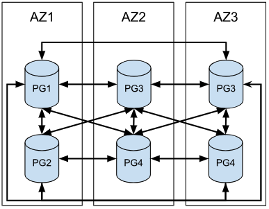

# pgEdge Distributed Postgres Architecture Models

As a Multi-Master Postgres replication solution, pgEdge Distributed Postgres supports several innovative architectural strategies. In this document, we'll categorize those strategies into two deployment types based on the types of nodes involved:

  * **PgEdge-only architectures** that only require pgEdge provided software to operate. This reduces the amount of moving parts and potential for system disruption or unexpected behavior. These should always be preferred when possible given the simplified design.

  * **Mixed-mode architectures** that combine pgEdge Distributed Postgres (VM Edition) and Postgres Physical Streaming Replication (PSR) nodes with a high-availability management layer. These architectures can be powerful, but have an increased complexity that makes configuration and management more difficult.

## Architecture At-A-Glance Summary

| Architecture | Sync | RPO2 | RTO3 | Latency | Cost |
|--------------|------|------|------|---------|------|
| Edge Nodes | No | seconds | < 20s | medium | low |
| Edge Nodes | Yes | 0 | < 20s | high | low |
| Paired Nodes | No | milliseconds | ~ 5s | low | medium |
| Paired Nodes | Local1 | 0 | ~ 5s | medium | medium |
| Replica | No | milliseconds | < 20s, 60-90s | low | medium |
| Replica | Yes | 0 | < 20s, 60-90s | medium | medium |
| N Replicas | No | milliseconds | < 20s, 30-60s | low | high |
| N Replicas | Yes | 0 | < 20s, 30-60s | low | high |

1. Paired nodes that reside in the same availability zone should be configured to use synchronous replication with each other. Cross-region synchronous replication is not usually recommended.

2. Recovery point objective (RPO) is based on network latency and replication replay lag. The table above focuses on network latency and in-flight transaction loss.

3. In columns where multiple recovery time objectives (RTO) are listed:

  * the first value is for cluster-wide traffic redirection.
  * the second value is for replica node promotion. 
  * a high-availability configuration is meant to address RPO deficiencies in single-node regional deployments.

### Architecture 1: pgEdge Nodes on the Network Edge

This architecture is the easiest and least expensive to deploy, with the widest capacity for regional distribution due to the low node count per location. However, catastrophic node loss implies a higher than average RPO due to in-transit transactions between regions (and the lack of a local replica).

It is possible to impose synchronous replication on logical replication relationships, though this also increases transaction commit latency to twice the latency between regions. This is a common tradeoff explained by the [PACELC](https://en.wikipedia.org/wiki/PACELC_design_principle) theorem.

The simplest example of this is a two-node design where each node is configured to act as a writable target in a different availability zone or region. This model is viable for customers with clusters that don’t *require* multiple locations with writable data, but who would like to take advantage of fast failover and leverage instant writability.

A three-node architecture adds only one node to the two-node baseline and shifts the focus toward geographical distribution without significant additional cost. Deployments using this design should primarily operate within their region or zone for little to no operational overlap to make the most of localized communications while also reducing conflict resolution requirements.

Further revisions to this design essentially extend the concept for additional regional isolation and maximal *edge* operation. The concept is only limited by node-to-node communication overhead imposed by the current pgEdge mesh network topology.

### Architecture 2: Paired Edge Nodes

This is a conceptual departure from a single pair of distributed pgEdge nodes, to a pair per location (providing high-availability). A minimal implementation in this case is simply two pgEdge nodes within the same region or zone. The goal is to reduce local failover times to the absolute minimum (five 9s) while still maintaining high write throughput for minimal latency. To perform a procedural failover, WRITE transactions are redirected to the alternate local pgEdge node; this enables much faster failover events than regional detection tolerances allow.

If your cluster resides in two regions or zones for Disaster Recovery (DR) or regional distribution purposes, a two-location node distribution would look like this:

This type of cluster could be distributed over three zones or regions with this layout:

!!! info

    This diagram demonstrates why pgEdge does not recommend high node counts in a single cluster. Regional node communication can become exponentially more expensive with the addition of each node.

### Mixed-Mode Architectures

Any time a Postgres physical streaming replication (PSR) node is present in a cluster, extraneous high-availability management software is necessary to mediate state transitions. pgEdge currently recommends using [Patroni](https://github.com/patroni/patroni) to provide this functionality.

This also requires a separate service to maintain a failover quorum for PSR-related nodes. Node-to-node communication must be configured to operate over a proxy channel [such as HAProxy](https://www.haproxy.org/). This ensures logical channels are always active no matter which node is currently a primary.

There are additional considerations when using synchronous replication in any cluster. Postgres synchronous replication requires at least one successful acknowledgement for each processed transaction before a transaction may be committed. Failure to do so will result in the local node being unable to process write transactions.

You can address this in one of three ways:

  * Add additional PSR nodes to the [synchronous_standby_names](https://www.postgresql.org/docs/17/warm-standby.html#SYNCHRONOUS-REPLICATION-CONFIG) list to enable safe synchronization; this allows any listed node to acknowledge write transactions.
  * Direct write traffic to an alternate zone for a short duration, at the cost of additional write latency.
  * Proactively configure an upstream node to temporarily disable synchronous writes during the maintenance cycle. Patroni does this automatically unless configured to operate in *strict* mode.

### Architecture 3: Using a Cluster with a Single Replica

This is a two-node variant architecture that adds a single synchronous or asynchronous physical streaming replica node to each node. This allows for fast promotions in failover scenarios to retain local regional writes. This cost-saving design which the fewest components necessary to provide failover resources with and without synchronous replication at the cost of additional latency during maintenance, or potentially reduced RTO while operating without a synchronous replica.

Each subsequent region requires a pgEdge node/PSR pairing, similar to the Paired Edge Node design, but with a much simpler communication topology.

### Architecture 4: Edge Nodes with Multiple Replicas

This model is an extension to the Single Replica architecture that addresses one or more additional requirements, providing:

  * Multiple read replicas for better database to application throughput.
  * Multiple synchronous replicas to avoid blocking upstream writes during maintenance or temporary outages.
  * a fully-isolated local quorum for involved nodes. The quorum requires a minimum of three participating nodes, so each region or zone has its own separate quorum layer and can act independently of the others.

Note that while this diagram denotes two local PSR nodes, there is no real limitation to the number of participating replicas.

